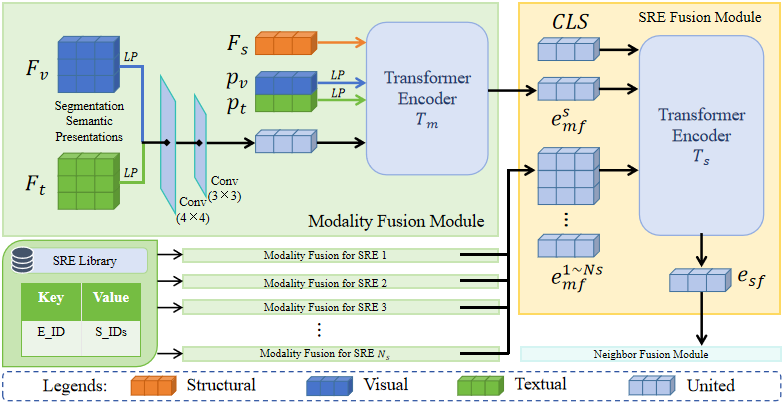
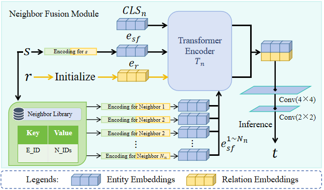

# Segmentation Similarity Enhanced Semantic Related Entity Fusion for Multi-modal Knowledge Graph Completion

## Model Architecture



[](https://www.python.org/downloads/)
[](https://pytorch.org/)
[](https://opensource.org/licenses/MIT)

## 🔍 Overview

M-REFT is a novel framework that introduces:
1. **Semantic Related Entities (SRE)**: Advanced multi-modal prior knowledge exploration through segmentation similarity-based selection algorithm
2. **Hierarchical Fusion Architecture**: Integrates neighbors and SREs via fusion-modality representation
3. **State-of-the-art Performance**: Demonstrated through extensive comparative and ablation studies

## ✨ Key Innovations
| Innovation | Technical Contribution |
|------------|-----------------------|
| Semantic Related Entities (SRE) | Novel SRE selection algorithm based on segmentation similarity matrix |
| M-REFT Architecture | Hierarchical fusion transformer integrating neighbors and SREs |
| Enhanced Inference | Achieves SOTA performance through multi-modal prior knowledge fusion |

## 🚀 Quick Start

### Installation
```bash
conda create -n mreft python=3.8
conda activate mreft
pip install -r requirements.txt
```

### Training
```bash
python main.py \
  --data DB15K \
  --dim 256 \
  --lr 5e-4 \
  --batch_size 1024 \
  --num_epoch 500
```

### Evaluation
```bash
python main.py --eval --ckpt_path ./ckpt/model_best.ckpt
```

## 📂 Data Preparation
1. Download dataset to `data/` directory
2. Expected structure:
```
data/
└── DB15K/
    ├── entities.txt
    ├── relations.txt
    ├── train.txt
    ├── valid.txt
    ├── test.txt
    ├── neighbors.pkl
    ├── SREs.pkl
    ├── segment_img_feature.pickle
    └── segment_txt_feature.pickle
```


## 📜 Citation
```bibtex
@inproceedings{mreft2025,
  title={M-REFT: Multi-modal Knowledge Graph Completion with Relational Feature Transformers},
  author={Author Name},
  booktitle={Proceedings of the 48th International ACM SIGIR Conference on Research and Development in Information Retrieval},
  series={SIGIR '25},
  year={2025},
  location={Padua, Italy},
  publisher={ACM},
  doi={10.1145/3726302.3730082},
  isbn={979-8-4007-1592-1/25/07}
}
```

## 🤝 Contact
For questions or collaborations, please contact:  
📧 wyp1120220314@dlmu.edu.cn

